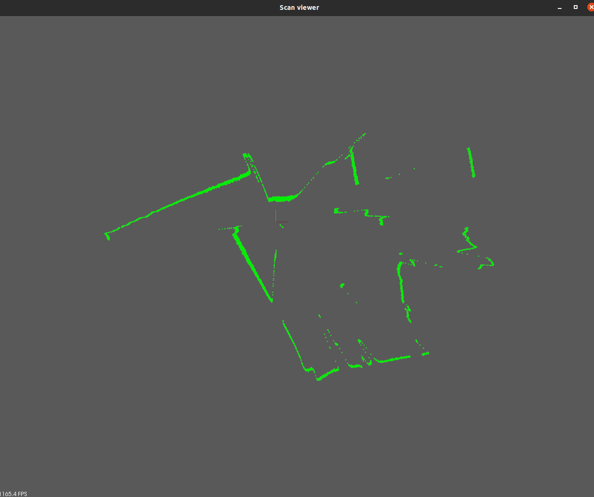

R2000-Visualizer
===============

This project uses the [R2000](https://github.com/Nandite/R2000) communication interface to capture scans and display it
as point cloud using a PCLViewer.

## Dependencies

This project depends on:
- [Boost](https://www.boost.org/) >= 1.64
- [PCL](https://pointclouds.org/) >= 1.8
- A [compiler](https://en.cppreference.com/w/cpp/compiler_support) supporting >= C++17

## Building and Usage

```sh
# With git < 1.65
git clone git@github.com:Nandite/R2000-Visualizer.git
cd R2000-Visualizer
git submodule update --init --recursive
# With git > 1.65
git clone --recursive git@github.com:Nandite/R2000-Visualizer.git
# With git > 2.13
git clone --recurse-submodules git@github.com:Nandite/R2000-Visualizer.git

mkdir build && cd build
cmake -DCMAKE_BUILD_TYPE=Release ..
make -j16

# TCP scan acquisition
# ./TcpAcquisition -a <device-ipv4-address>
./TcpAcquisition -a 192.168.2.30
# or
# UDP scan acquisition
#./UdpAcquisition -a <device-ipv4-address> -t <destination-ipv4:port>
# Given that the address of the machine running the program is 192.168.2.15
./UdpAcquisition -a 192.168.2.30 -t 192.168.2.15:62000 
```
The programs will launch a PCLViewer displaying the output of the sensor:



## Feedback

Don't hesitate if you have any suggestions for improving this project, or if you find any error. I will be glad to
hear from you. There are traits that have been implemented yet. You can submit implementations suggestions.
Contributions are welcomed :)

## License

Distributed under the MIT Software License (X11 license).
See accompanying file LICENSE.